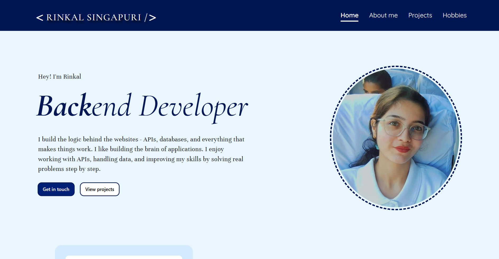
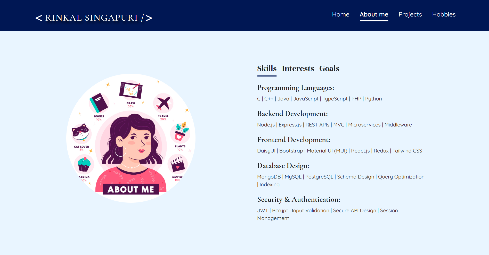
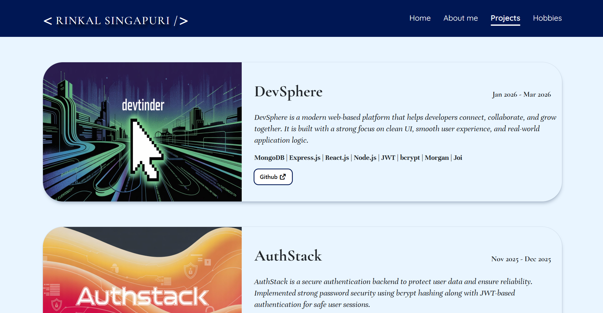
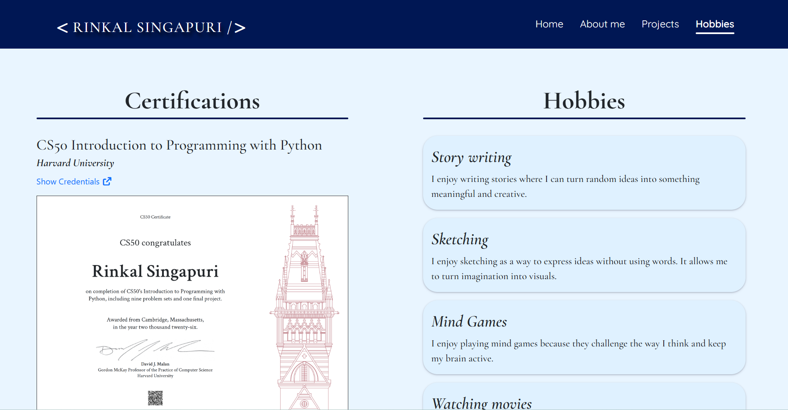

# Mini Portfolio

> A minimalistic portfolio website built with HTML, CSS, and JavaScript to showcase personal projects, skills, and interests in a clean, responsive layout.

**Live Demo:** <video_link>

---

## Table of Contents

- [Mini Portfolio](#mini-portfolio)
  - [Table of Contents](#table-of-contents)
  - [About](#about)
  - [Features](#features)
  - [Technologies Used](#technologies-used)
  - [Screenshots](#screenshots)
  - [Section Overview](#section-overview)
    - [`Home`](#home)
    - [`About Me`](#about-me)
    - [`Projects`](#projects)
    - [`Hobbies`](#hobbies)
    - [`Header`](#header)
    - [`Footer`](#footer)
  - [Design Highlights](#design-highlights)
  - [Getting Started](#getting-started)
  - [Conclusion](#conclusion)

---

## About

Mini Portfolio is a personal branding website that presents an individual's work, background, and interests in a simple, elegant manner. The project focuses on front-end development skills, including layout structuring, responsive design, and interactive elements using vanilla JavaScript.

---

## Features

- Fully responsive design (mobile, tablet, desktop)
- Clean and minimalistic user interface
- Modular HTML sections (Home, About Me, Projects, Hobbies)
- Expandable "About Me" section with show/hide functionality
- Styled project cards with hover effects
- Color-coded hobbies section
- Consistent header and footer across all pages
- Reusable CSS architecture (configuration + component-specific)

---

## Technologies Used

| Technology | Purpose |
|------------|---------|
| HTML | Page structure and content |
| CSS | Styling, layout, and responsive design |
| JavaScript | Interactive elements (section expand/collapse) |
| Git | Version control |

---

## Screenshots






---

## Section Overview

### `Home`
The landing area of the portfolio.

- Introduces the person with a brief tagline
- Sets the visual tone for the rest of the site
- Serves as the navigation anchor

### `About Me`
Provides background information about the individual.

- Contains a short bio
- Implements an **expand/collapse** feature using JavaScript to show/hide additional details
- Keeps the layout clean while offering more content on demand

### `Projects`
Showcases completed work or sample projects.

- Displays project cards with titles and descriptions
- Includes hover effects for better interactivity
- Demonstrates layout skills and attention to detail

### `Hobbies`
Highlights personal interests outside of work.

- Uses different colors for each hobby entry
- Adds visual variety and personality to the portfolio

### `Header`
Common header component across pages.

- Contains site navigation menu
- Designed with a reusable CSS file (`header-footer.css`)
- Provides consistent user experience

### `Footer`
Standard footer section.

- Includes copyright or other meta information
- Styled consistently with the header
- Also managed through `header-footer.css`

---

## Design Highlights

| Element | Styling Approach |
|---------|------------------|
| Global Styles | Central `configuration-css.css` for resets, fonts, and color variables |
| Header & Footer | Separate `header-footer.css` for consistent navigation and meta areas |
| About Me Section | JavaScript toggles a CSS class that shows/hides extra paragraph |
| Project Cards | Rounded corners, subtle shadows, and scale transition on hover |
| Hobbies List | Each hobby has a unique background or text color |
| Responsiveness | Media queries adjust layout for smaller screens |

---

## Getting Started

```bash
# Clone the repository
git clone https://github.com/Rinkal159/Mini-portfolio.git

# Navigate into the project folder
cd Mini-portfolio

# Open the project
# Simply open index.html in your web browser
```

---

## Conclusion

Mini Portfolio demonstrates essential front-end development concepts in a real-world personal project:

- Semantic HTML structuring
- Modular and maintainable CSS (configuration + component files)
- JavaScript event handling and DOM manipulation
- Responsive design principles
- Interactive UI components (expand/collapse)
- Consistent styling across multiple sections